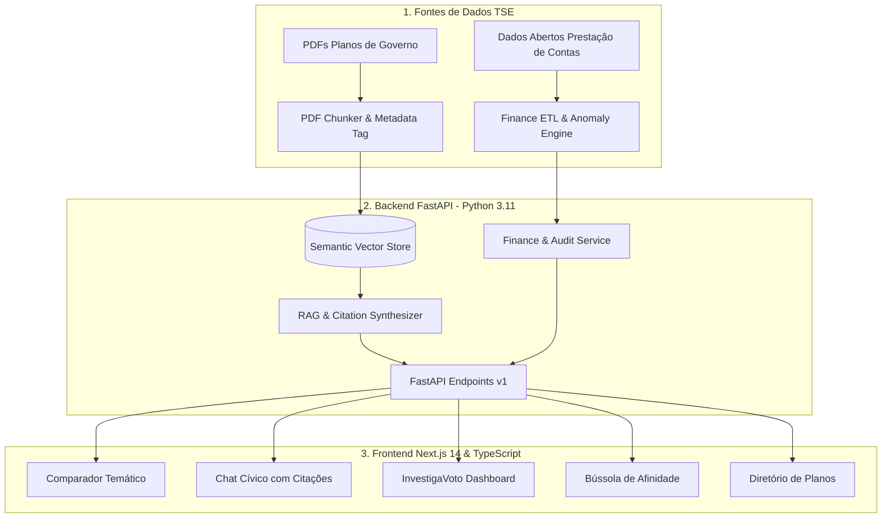

# 🤖 Radar de Propostas IA + InvestigaVoto (RAG + Data Forensics)

> **Plataforma Cívica 360° de IA Generativa (RAG) & Auditoria Forense de Gastos de Campanha e Planos de Governo Oficiais.**

[](https://github.com/Renanbritto/radar-propostas-ia/actions)
[](https://fastapi.tiangolo.com)
[](https://nextjs.org/)
[](https://www.typescriptlang.org/)
[](https://python.org)
[](https://tailwindcss.com)
[](LICENSE)

---

## 🎯 Sobre o Projeto

O **Radar de Propostas IA + InvestigaVoto** é uma plataforma cívica completa de dados públicos que une duas pontas essenciais do processo eleitoral:
1. **O que os candidatos prometem:** Análise semântica e busca via RAG com citações auditáveis de página a partir dos PDFs oficiais do TSE.
2. **De onde vem e para onde vai o dinheiro:** Auditoria forense de prestação de contas, receitas, maiores fornecedores contratados, empresas recém-abertas e detecção de anomalias.

---

## 🚀 Principais Módulos da Plataforma

### 1. 🔍 Comparador Temático Lado a Lado (RAG)
* **Contraste de Propostas:** Compare múltiplos candidatos simultaneamente para qualquer um dos 8 eixos temáticos (Saúde, Educação, Segurança, Economia, etc.).
* **Mapeamento de Convergências e Divergências:** Destaque de pontos de conflito programático e estratégia orçamentária.

### 2. 💬 Chat RAG Cívico com Citações Auditáveis
* **Q&A Semântico:** Pergunte em linguagem natural aos planos de governo.
* **Citação Transparente:** Modal de auditoria indicando a página exata e o trecho oficial submetido ao TSE (zero alucinações).

### 3. 💰 InvestigaVoto: Auditoria Forense de Campanha
* **Panorama Financeiro:** Total arrecadado (FEFC, Doações PF, Recursos Próprios) vs. Despesas declaradas.
* **Detector de Anomalias:** Alertas de alta concentração de verba (> 45% em um único fornecedor) e empresas abertas a menos de 6 meses da eleição.
* **Tabela de Fornecedores:** Mapeamento de CNPJs, serviços prestados, valores recebidos e nível de risco forense.
* **Promessa vs. Gasto:** Cruzamento entre a prioridade declarada no plano e a alocação real de recursos na campanha.

### 4. 🧭 Bússola de Afinidade (Quiz de Prioridades)
* **Match Programático:** Questionário interativo que calcula a afinidade vetorial entre o eleitor e as propostas dos candidatos.

---

## 🏗️ Arquitetura do Sistema



---

## 📂 Estrutura de Diretórios

```
radar-propostas-ia/
├── backend/
│   ├── app/
│   │   ├── api/v1/endpoints/       # Endpoints: candidates, compare, chat, quiz, finances
│   │   ├── core/                   # Settings, Pydantic BaseSettings, logging
│   │   ├── data/                   # Datasets de planos e prestação de contas
│   │   ├── models/                 # Pydantic v2 schemas tipados
│   │   ├── services/               # RAG Engine, VectorStore, Comparator, FinanceService
│   │   └── main.py                 # FastAPI Application
│   ├── tests/                      # Pytest test suite (12 testes passando)
│   ├── Dockerfile
│   └── requirements.txt
│
├── frontend/
│   ├── src/
│   │   ├── app/                    # Next.js App Router (/, /comparador, /chat, /quiz, /financiamento, /candidatos)
│   │   ├── components/             # Liquid Glass UI, Header, Footer, CitationBadge
│   │   ├── lib/                    # API client tipado & helpers
│   │   ├── styles/                 # Tailwind design tokens & globals.css
│   │   └── types/                  # TypeScript interfaces
│   ├── package.json
│   ├── tailwind.config.ts
│   └── tsconfig.json
│
├── .github/workflows/ci.yml        # CI Pipeline (GitHub Actions)
├── docker-compose.yml              # Container orchestration
├── .env.example                    # Template de variáveis de ambiente
├── .gitignore
└── README.md
```

---

## ⚡ Como Executar Localmente

### Opção 1: Via Docker Compose (Recomendado)
```bash
# Clone o repositório
git clone https://github.com/Renanbritto/radar-propostas-ia.git
cd radar-propostas-ia

# Copie as variáveis de ambiente
cp .env.example .env

# Suba todos os serviços
docker-compose up --build
```
Acesse:
* **Frontend:** `http://localhost:3000`
* **API Docs (Swagger/OpenAPI):** `http://localhost:8000/docs`

---

### Opção 2: Execução Manual

#### 1. Backend (Python 3.11+)
```bash
cd backend
python -m venv .venv

# Windows
.\\.venv\\Scripts\\activate
# Linux/macOS
source .venv/bin/activate

pip install -r requirements.txt
uvicorn app.main:app --host 0.0.0.0 --port 8000 --reload
```

#### 2. Frontend (Node.js 18+)
```bash
cd frontend
npm install
npm run dev
```

---

## 🧪 Testes Automatizados

O backend conta com 12 testes unitários e de integração com `pytest`:

```bash
cd backend
pytest tests/ -v
```

---

## 👨‍💻 Autor

Desenvolvido por **Renan Nocelli Britto**
* **Portfólio:** [renannocelli.dev](https://renannocelli.com.br)
* **LinkedIn:** [linkedin.com/in/renan-nocelli](https://linkedin.com/in/renan-nocelli)
* **GitHub:** [@Renanbritto](https://github.com/Renanbritto)

---

## 📜 Licença

Distribuído sob a licença MIT.